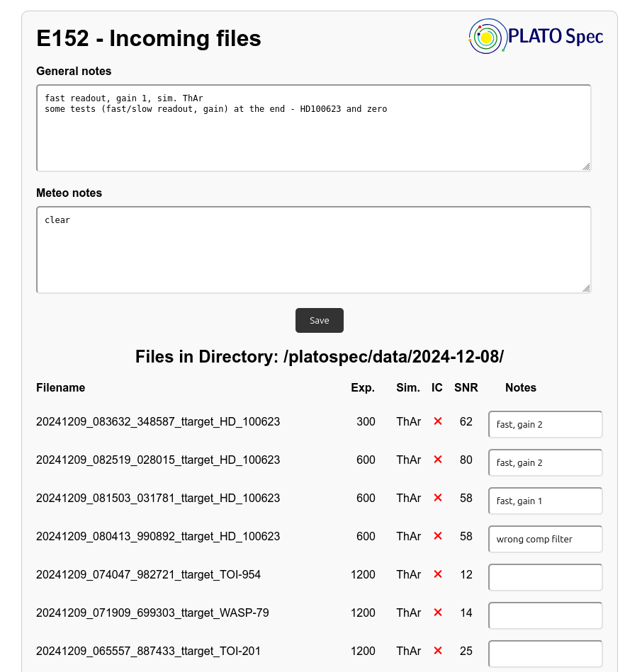
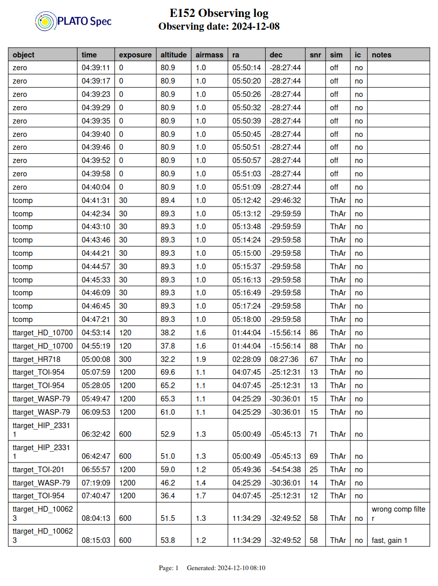
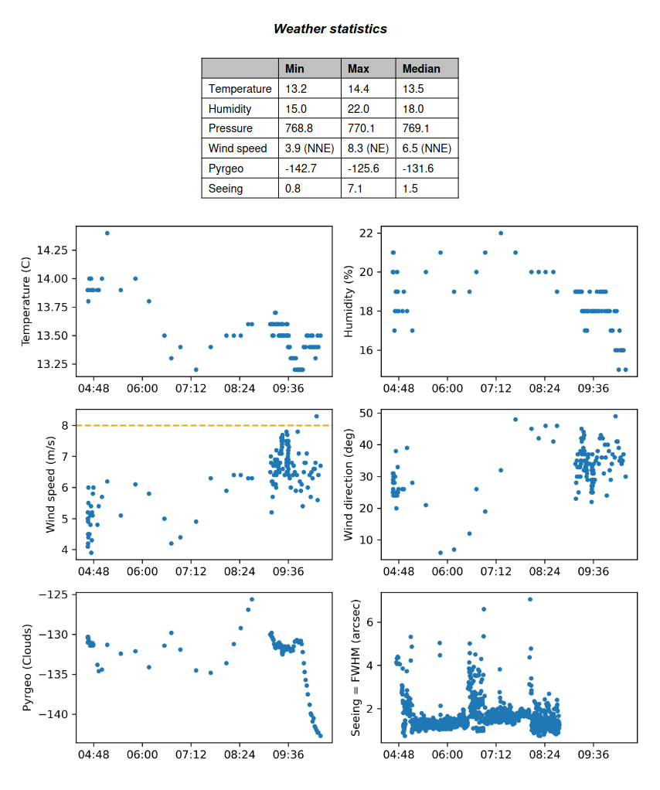

# Observing logs


[](https://app.codacy.com/gh/pavolgaj/NightLog/dashboard?utm_source=gh&utm_medium=referral&utm_content=&utm_campaign=Badge_grade)

Observing log for PlatoSpec (E152). Created automatically based on the header of FITS files. Web interface to add notes to the observations, which will be included in the generated log.

## Requirements

- python3
- matplotlib
- pandas
- numpy
- scipy
- scikit-image>=0.24
- astropy>=5.2
- reportlab
- flask
- waitress (deploying server)

## Instalation

- clone this repository
- (optional) create and activate the virtual environment: e.g. ```python3 -m venv nightlog-venv``` and ```source nightlog-venv/bin/activate```
- install requirements: ```pip install -r requirements.txt```

## File description

- fwhm.py - module for seeing estimation (based on star's FWHM)
- make_log.py - generating log files
- PDFReportClass.py - module for PDF creation
- snr.py - module for SNR of spectra images estimation
- web.py - server part of web interface
- *.sh - simple scripts to start the web interface or generate logs
- *-mask.dat - example of mask for simultaneous calibration - parts to be ignored during SNR estimation

## Folder description

- data - input folder with data (change in ```web.py``` if needed)
- fwhm - output folder with estimated values of FWHM
- guider - input folder with images from guiding camera (change in ```web.py``` and ```make_log.py``` if needed)
- logs - output folder with generated logs
- notes - output folder with observing notes
- static - folder with static files (images etc.) for the web interface
- templates - folder with HTML templates for web interface

## Web interface

- start using ```flask --app web run --host=0.0.0.0 -p 5000``` or ```python3 -m flask --app web run --host=0.0.0.0 -p 5000``` or running ```web_start.sh``` (running on port 5000) - for testing phase
- start using ```waitress-serve --host 0.0.0.0 --port=5000 web:app``` or ```python3 -m waitress-serve --host 0.0.0.0 --port=5000 web:app``` or running ```web.sh``` (running on port 5000) - for production phase
- running on ```localhost:5000```

### General interface

- running as the main page on ```localhost:5000```  
- loads all FITS files from the last subdirectory of the given folder
- user can add notes to each file (necessary to save after changes)
- notes could be added also for the whole night as general or meteo notes
- notes are saved to a JSON file named according to the individual night in the specific directory
- refresh every 60s



### Admin interface!

- for modification notes for old nights
- running on ```localhost:5000/admin```
- loads all FITS files for a given night
- work similar to the standard interface
- under password protection
- re-generate log

### Downloading logs

- download already generated logs (see below)
- running on ```localhost:5000/logs```
- files sorted from the newest one

### Current Conditions

- display current weather and observing conditions
- based on the FITS header and data from the guiding camera
- running on ```localhost:5000/conditions```


## Creating log

- using ```python make_log.py input_folder``` or running ```new_log.sh```, ```last_log.sh```, ```all_logs.sh```
- used functions are in ```PDFReportClass.py```
- generates logs as PDF and CSV files
- includes observer notes from the web interface (saved in JSON files)
- read information from the FITS header of data files

  
  
